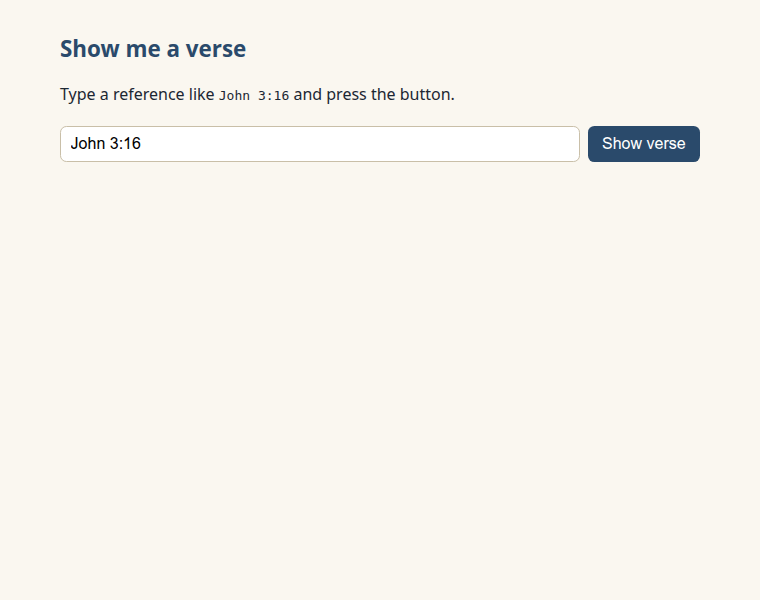
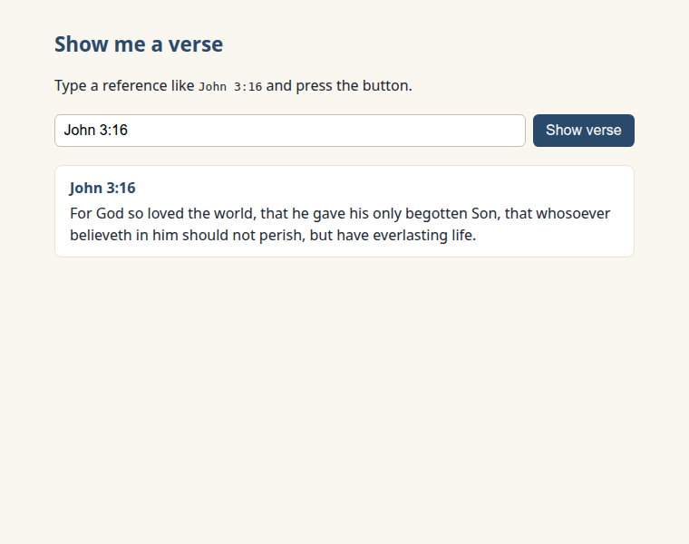
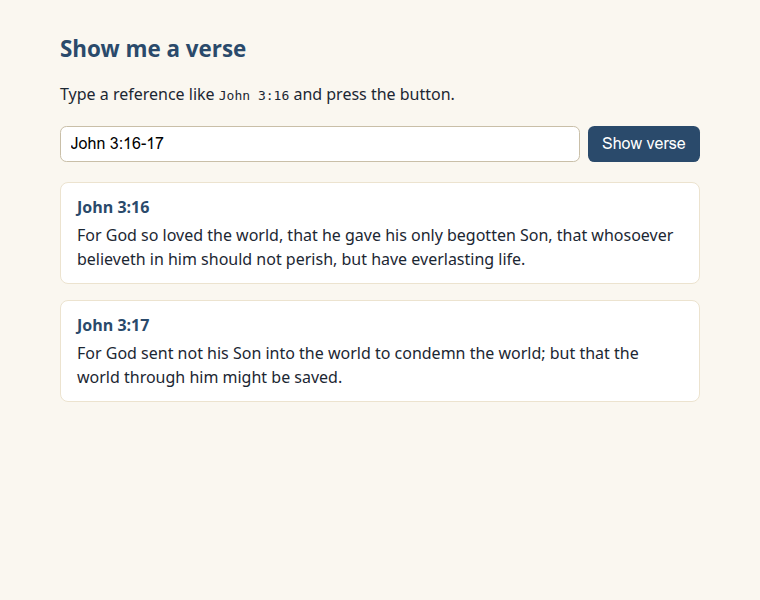
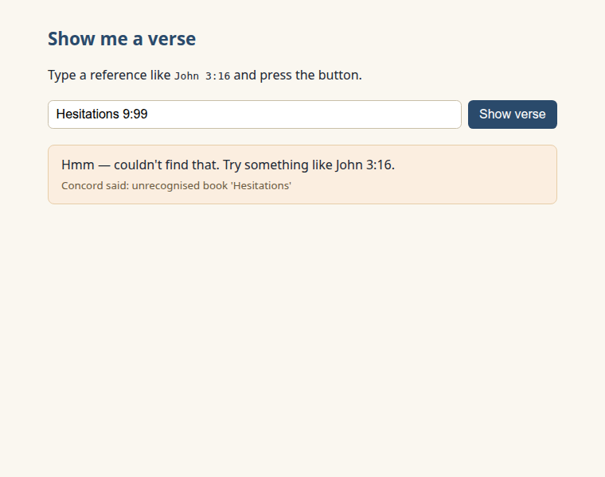
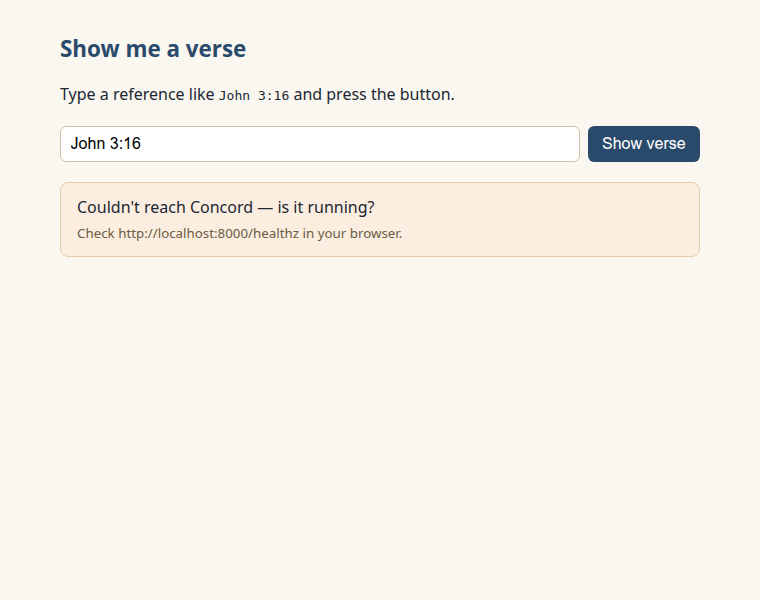

New here? Do the one-time [SETUP.md](../../SETUP.md) first.

# Lesson 2 — Show me a verse

In Lesson 1 you pulled a verse by hand, straight from the address bar. Now let's let your
*users* do it — type a reference, click a button, and watch the verse appear on a page that's
yours.

## What we're building

A tiny page: a box to type a reference, a button, and the verse appears below. It's all in one
file, `verse.html`, right here in this folder.

## Run it and see it work

1. Start your local preview the way SETUP.md showed you — in VS Code, that's the "Go Live" button
   (if you used the terminal way, it's already running). Then open
   `http://localhost:5500/verse.html`. Your screen should look about like this:

   
2. `John 3:16` is already in the box — click "Show verse." The verse appears on your page.

That's **the win**: a user typed a reference, and your page answered.



Now poke at it:

- Type a range like `John 3:16-17` — both verses show.

  
- Type something made-up like `Hesitations 9:99` — you get a friendly "couldn't find that," not a
  crash.

  
- Stop Concord and try again — you get a calm "is it running?" message instead of a blank page.

  

## The code, piece by piece

Want to see how it works? Here's the whole loop — open `verse.html` in your editor and follow
along. The loop your page runs is: **send a request → get JSON back → put it on the page.**

### Where Concord is

The first line of the script names the address your page talks to:

```js
const CONCORD = "http://localhost:8000"; // change this only if Concord runs on another computer
```

Leave it alone if Concord is on the same computer as you. (If it's elsewhere, SETUP.md covers
the one-line change.)

### Asking for the verse

When someone clicks the button, we build the same URL you typed in Lesson 1 and *fetch* it.
**`fetch`** is the browser's built-in way to ask a web address for data:

```js
const url = `${CONCORD}/v1/verses/${encodeURIComponent(ref)}`;
const response = await fetch(url);
```

`encodeURIComponent` tidies up what the user typed so a space becomes `%20` — the same thing you
saw happen in the address bar. `await` just means "wait right here until Concord answers, then
keep going."

### Reading the answer

Concord answers in **JSON** — a text format for data. One line turns that text into something
your code can use (that step is called *parsing*):

```js
const data = await response.json();
```

Inside `data` is a list called `verses`. Each verse already carries a ready-made label in
`reference` (like `"John 3:16"`) and its words in `text`. We loop over the list and put each one
on the page:

```js
for (const v of verses) {
  // v.reference  → "John 3:16"
  // v.text       → { "KJV": "For God so loved the world, ..." }
}
```

Because it's a loop, typing a range like `John 3:16-17` just works — you get both verses, no
extra code.

### When something goes wrong

A real page never shows a blank screen or a scary error. There are two things that can go wrong,
and we answer each one kindly:

- Concord isn't running — the `fetch` never connects, so we catch that and say: *"Couldn't reach
  Concord — is it running?"*
- The reference doesn't exist — Concord replies with a tidy error note,
  `{ error: { message, ... } }`. We read that and say something gentle: *"Hmm — couldn't find
  that. Try something like John 3:16."*

That friendly handling is part of the lesson, not an extra — it's what separates a page that
*works* from one that just works *when you're lucky*.

---

### What you just learned about APIs

- Your code sends a request to a URL and gets JSON back.
- You read fields out of that JSON and put them on the page — that's most of what a web app does.

### You can now…

…turn what a user types into a live verse on your page.

That `text` you just displayed is keyed by translation — the very shape Lesson 4 uses to show
several translations side by side. Next up, [Lesson 3](../03-find-by-idea/): help users *find* a
verse they don't already know.
