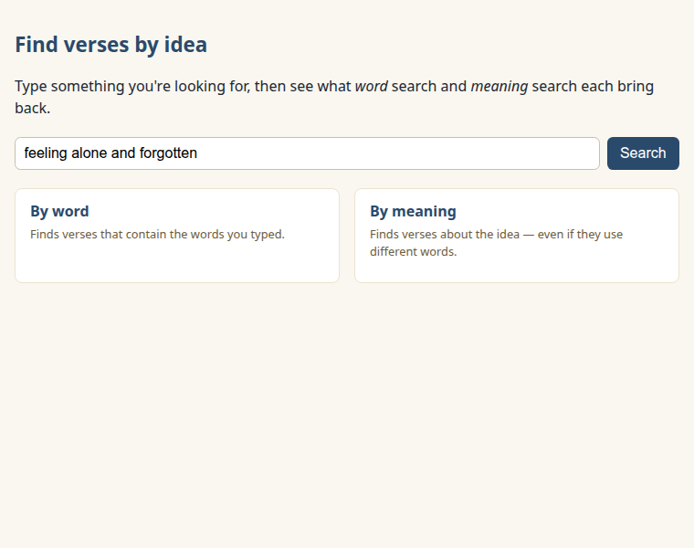
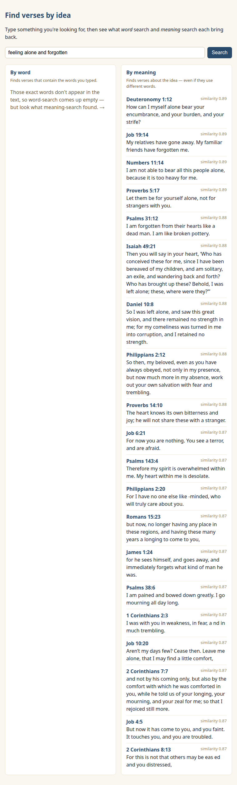
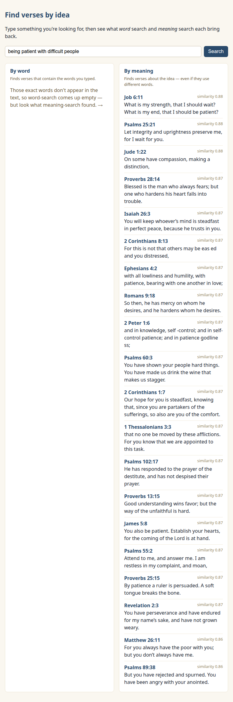

New here? Do the one-time [SETUP.md](../../SETUP.md) first.

# Lesson 3 — Find verses by idea

Your app can already show a verse someone *already knows*. Now let's help them find one they
**don't** — by searching not just for words, but for ideas.

## What we're building

One search box and two columns side by side: a *word* search (verses that contain the exact words
you typed) and a *meaning* search (verses about the idea, even in different words). It's all in
`search.html`, right here in this folder.

## Run it and see it work

1. Start your local preview the way SETUP.md showed you (in VS Code, the "Go Live" button), then
   open `http://localhost:5500/search.html`.
2. A search is already typed in — `feeling alone and forgotten`. The page opens like this:

   
3. Click "Search." Here's what comes back:



Look at the difference. The **word** column came up empty — none of those exact words appear
together in the text. That's *not* a bug; it's the whole point. The **meaning** column, mean­while,
is full of verses that are clearly about feeling alone and forgotten — Job's friends failing him,
the psalmist crying *"I am forgotten… like a dead man"* — even though they never use your words.

### Try a few more

- Search `being patient with difficult people` — word search comes up empty again, but meaning
  search finds verses about patience, compassion, and a steadfast mind:

  
- Try your own idea in your own words. The further your wording is from the Bible's, the more the
  two columns disagree — and the more useful meaning search becomes.

An empty word column is never an error here. When the exact words aren't in the text, the page
says so plainly and points you to what meaning search found.

## How it works, piece by piece

Want to see how it works? Open `search.html` and follow along. The new idea this lesson is all
about lives in the two web addresses we call.

### Query parameters — asking a more specific question

Everything after the `?` in a URL is a **query parameter** — a way to ask an endpoint a more
specific question. Join several with `&`. One button fires *two* searches, each a different
endpoint with the same question:

```js
// the words you typed, made URL-safe, asked of two different endpoints
const word    = `${CONCORD}/v1/search?q=${encodeURIComponent(q)}&translation=WEB`;
const meaning = `${CONCORD}/v1/semantic-search?q=${encodeURIComponent(q)}&translation=WEB`;
```

Both ask for `translation=WEB`, so the columns differ only in *which verses* each method finds —
not which translation they're in. (`encodeURIComponent` is the same tidy-up from Lesson 2.)

### Two lists to loop over

Each endpoint answers with a **list**, and your code loops over it — the same move from Lesson 2,
now done twice:

```js
for (const hit of data.hits) { /* word results: reference + a highlighted snippet */ }
for (const r   of data.results) { /* meaning results: reference + the verse text */ }
```

Word search even hands back a ready-made snippet with the matched words wrapped in `<mark>` tags,
so the page can highlight them. (That markup comes from Concord, so it's safe to drop straight in.)

### Why the word column missed

Word search can only find words that are *there*. "Feeling alone and forgotten" isn't a phrase
the Bible uses, so word search finds nothing. Meaning search compares the *idea* of your words
against every verse and returns the closest ones — which is why it found a column full of verses
you'd never reach by typing.

> **Did you know?** The word-search endpoint can be used with *no JavaScript at all* — a plain
> `<form method="get" action=".../v1/search">` will submit your query and land the browser right
> on the JSON. (That trick works for `?q=` searches like this one, not for the `/verses/{ref}`
> address from Lesson 2.) We use JavaScript here so both columns can share one button.

## When something goes wrong

The same friendly handling as Lesson 2, per column: if Concord can't be reached you get the calm
"is it running?" note instead of a blank page. And if a particular Concord has meaning search
switched off (it's on by default), the meaning column says so kindly and links the setting —
right where you'd notice it, not as a warning up front.

---

### What you just learned about APIs

- Parameters after `?` let you ask an endpoint a more specific question, and `&` joins several.
- Many endpoints answer with a *list*, and your code loops over it to build the page.

### You can now…

…search Scripture by meaning **and** by word — and you understand the difference.

Next up, [Lesson 4](../04-compare-and-where/): the capstone — compare translations side by side
and show *where* Scripture happened.
