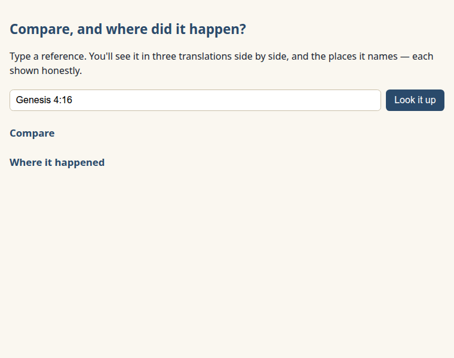
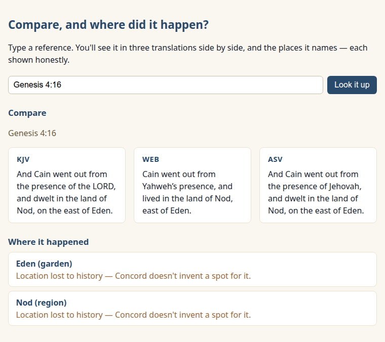
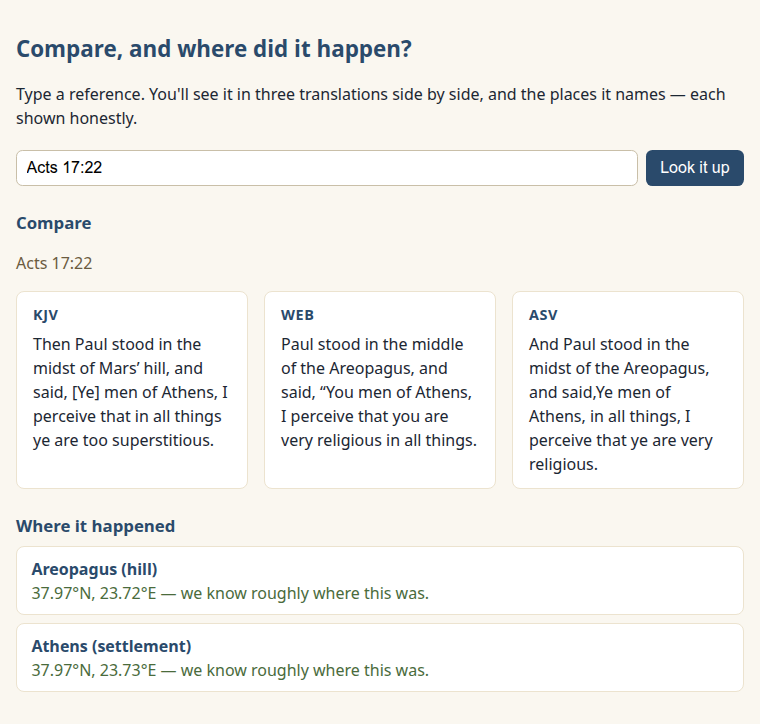
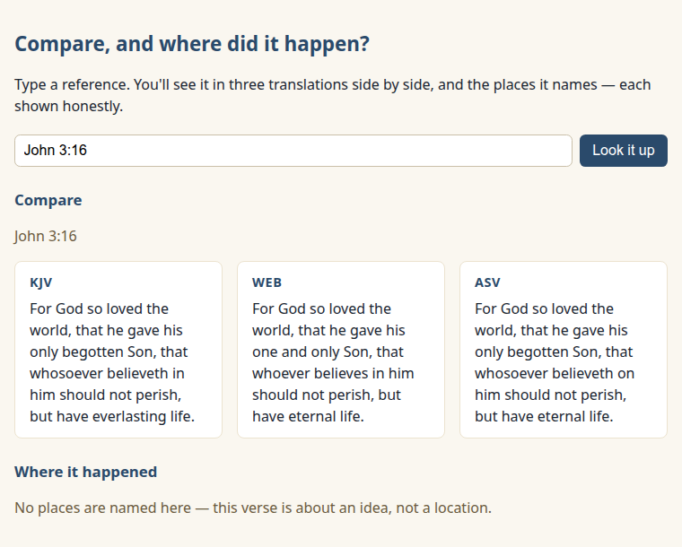

New here? Do the one-time [SETUP.md](../../SETUP.md) first.

# Lesson 4 — Compare, and where did it happen?

You can fetch a verse, and you can search by idea. Now let's build the real thing — a single page
that does two jobs at once, the kind of app you'd actually show someone.

## What we're building

One page, one reference, two answers: how the verse reads across three translations, and where it
happened — shown **honestly**, including the places history has lost. It's all in `app.html`, right
here in this folder.

## Run it and see it work

1. Start your local preview the way SETUP.md showed you (in VS Code, the "Go Live" button), then
   open `http://localhost:5500/app.html`. The page opens like this:

   
2. `Genesis 4:16` is already in the box — click "Look it up."

Here's the whole app working at once:



Two things just happened on one page. The *Compare* half shows the same verse in three
translations — watch how they render God's name differently (KJV "the LORD," WEB "Yahweh," ASV
"Jehovah"). The *Where* half names the two places the verse mentions, Eden and Nod — and tells you
the truth: their locations are lost to history. Your app does not invent a dot on a map to look
clever. **That honesty is the whole point of this lesson.**

### Try a few more

- Look up `Acts 17:22` — here Concord *can* place things, so you see real coordinates for Athens
  and the Areopagus (the hill the KJV calls "Mars' hill"):

  
- Look up `John 3:16` — no places at all, because it's about an idea, not a location. The Where
  section says so plainly instead of straining to find one:

  

## How it works, piece by piece

Open `app.html` and follow along. The new idea is **composing calls**: a real app asks more than
one question and weaves the answers into one view.

### One reference, two questions

When you click the button, the page makes *two* requests for the same reference and fills a section
with each:

```js
renderCompare(ref);  // GET /v1/verses/{ref}?translations=KJV,WEB,ASV
renderWhere(ref);    // GET /v1/verses/{ref}/places
```

That's it — that's the leap from "a page" to "an app." Each section handles itself, so a hiccup in
one never blanks the other.

### Three translations, and an honest gap

The compare call returns the verse with its text keyed by translation — the same shape from Lesson
2, now asked for three at once. We loop the three and show each in its own column. And once in a
while a translation simply doesn't include a verse; when that happens we say so, rather than
showing a confusing blank:

```js
if (isMissing(v.text[t])) slot.textContent = "(this translation doesn't include this verse)";
```

### Places — and why we never fake a pin

Each place comes back with a `status`. Some Concord can locate (`identified`, `disputed`) — those
have real coordinates, and we show them. Others (`unknown`, `symbolic`, `multiple`) come back with
**no coordinates at all**, on purpose — Concord refuses to guess. So our app refuses too:

```js
if (p.status === "unknown") return "Location lost to history — Concord doesn't invent a spot for it.";
```

A lesser app would drop a pin in the desert and move on. Yours tells the truth. When you build for
people who care about Scripture, that honesty is worth more than a tidy-looking map.

## When something goes wrong

The same calm handling as before, per section: if Concord can't be reached you get "Couldn't reach
Concord — is it running?"; a reference that doesn't exist gets a friendly "couldn't find that." A
verse with no places isn't an error — it's just the honest answer.

---

### What you just learned about APIs

- One app can call several endpoints and weave the answers into a single view.
- Good apps present uncertain data honestly — they'd rather say "we don't know" than fake confidence.

### You can now…

…build a real, multi-feature app — running entirely on your own computer, with no internet.

**This is a finished thing you could open in front of your pastor.** It compares translations and
tells the truth about where Scripture happened, and it runs with no internet beyond your own
Concord — nothing phones home. You can stop right here, proud of what you built.

Or, if you'd like to see those located places on an actual map, [Lesson 5](../05-drop-the-pins/) is
the stretch — the one optional step that reaches the internet, with the tradeoff explained.
