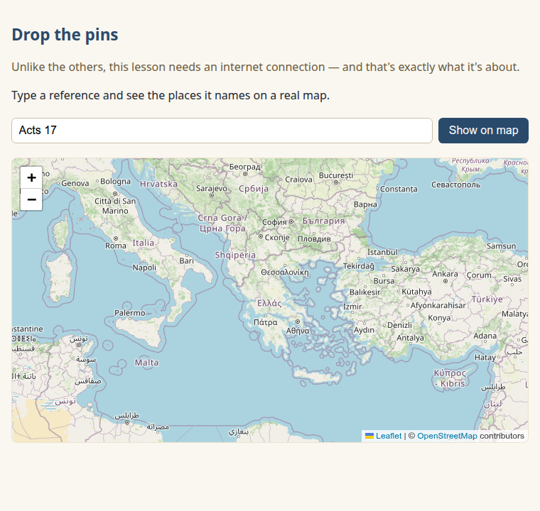
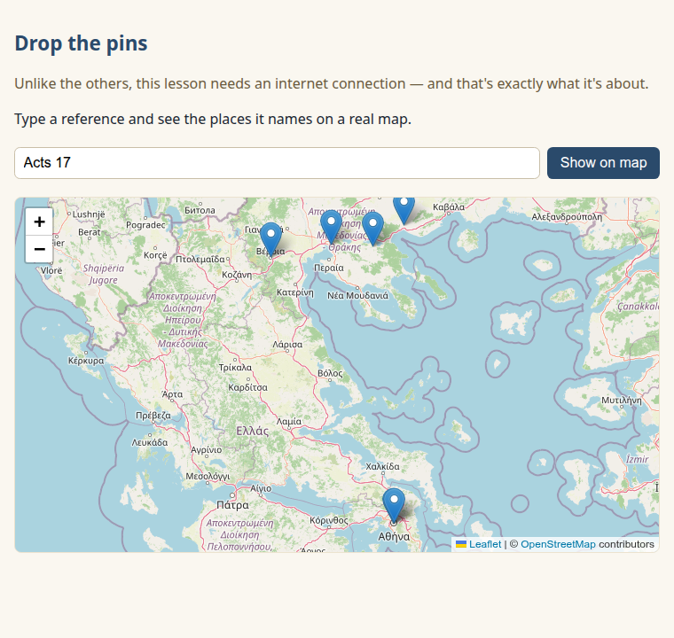
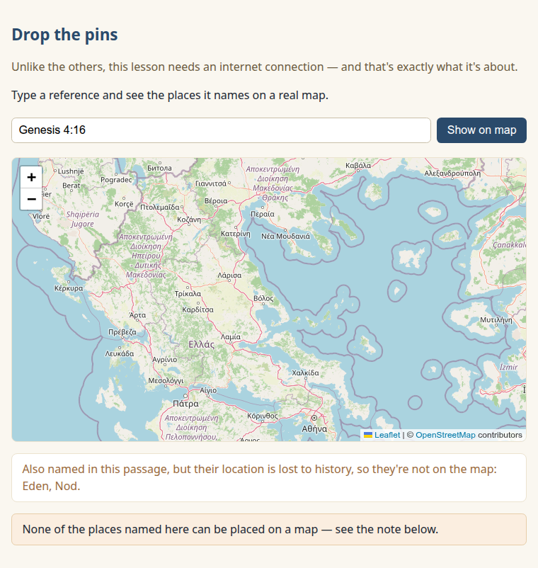

New here? Do the one-time [SETUP.md](../../SETUP.md) first.

# Lesson 5 — Drop the pins *(optional — the stretch)*

Unlike the others, this lesson needs an internet connection — and that's exactly what it's about.

Your capstone already shows *where* in honest words. Now let's put those places on a real map you
can pan and zoom — and meet the one tradeoff that comes with it.

## What we're building

The same "where did it happen?" question as Lesson 4, but on a real map: a pin for every place
Concord can locate, and an honest list of the ones it can't. It's all in `app-map.html`, here in
this folder.

## Run it and see it work

1. Start your local preview the way SETUP.md showed you (in VS Code, the "Go Live" button), then
   open `http://localhost:5500/app-map.html`. A map appears:

   
2. `Acts 17` is already in the box — click "Show on map."

The places from Paul's journey drop onto the map as pins:



Each pin is a place Concord could locate; click one to see its name. That's a real, pannable map of
where Scripture happened — built by you.

### Try a few more

- Look up `Genesis 4:16`. Its two places — Eden and Nod — have no known location, so there are no
  pins. Instead the app names them honestly, below the map:

  

  This is the honesty model from Lesson 4, now made visible: **a pin means we know; a footnote means
  we don't.** The map literally cannot lie, because Concord never hands it a fake coordinate.
- Look up `John 3:16` — no places at all, so the map has nothing to show, and says so.

## How it works, piece by piece

Open `app-map.html` and follow along. Two new things make the map possible.

### Borrowing a library

Every line of code so far, you wrote yourself in one file. This time we **borrow a library** —
code other people wrote and shared, that you use by linking to it. No installing; just two lines in
the page that pull in [Leaflet](https://leafletjs.com/), a popular mapping library:

```html
<link rel="stylesheet" href="https://unpkg.com/leaflet@1.9.4/dist/leaflet.css" ... />
<script src="https://unpkg.com/leaflet@1.9.4/dist/leaflet.js" ...></script>
```

(The `integrity="..."` attribute is a safety check — the browser refuses the file if it's been
tampered with. A small, grown-up habit when you borrow code from the internet.)

### A map made of tiles

Leaflet draws the map out of **tiles** — small square images that stream in from a map server as
you pan and zoom. We use OpenStreetMap's, with the credit they ask for:

```js
L.tileLayer("https://tile.openstreetmap.org/{z}/{x}/{y}.png", { maxZoom: 19, attribution: "… OpenStreetMap …" });
```

One thing that trips everyone up once: the map's box needs a real height in the CSS, or you get a
blank space and no error. Ours has `#map { height: 400px; }`.

### Pins for the found, a list for the lost

We reuse Lesson 4's places call, then split the results: places with coordinates become pins; places
without coordinates can't be drawn, so we never try — we list them under the map instead.

```js
const located = data.places.filter((p) => p.latitude !== null);  // these get pins
const lost    = data.places.filter((p) => p.latitude === null);  // these get an honest note
```

### The tradeoff you just made

Here's the honest part, and the real lesson. Lessons 1–4 ran *entirely* on your own computer —
nothing left the building but your questions to your own Concord. This lesson is different: the map
library and every tile come from the internet. So your app is no longer purely offline; to draw the
map, it reaches out.

That's a real trade, and a builder makes it on purpose: you gained a live, explorable map, and you
gave up the nothing-phones-home property the earlier lessons had. Neither choice is wrong — they're
*different*, and now you can see the seam between them. *(A grown-up aside: you could host your own
tile server to win the privacy back. People do exactly that.)*

---

### What you just learned about APIs

- Libraries let you stand on other people's work — you don't have to build everything yourself.
- Every outside dependency is a tradeoff: here, a map in exchange for a network connection you
  didn't need before.

### You can now…

…put your data on a map — and you understand the tradeoff you made to do it.

## You're a Concord builder now

That's all five lessons. You started not sure what an API was, and you've built a real, honest app
on top of Concord — one that compares translations, tells the truth about where Scripture happened,
and now shows it on a map. That's genuinely yours. Open it for someone.

Where builders go next:

- **Steal freely** — [recipes.md](../../recipes.md) has the paste-ready snippets from these lessons.
- **Build something of your own** — [ideas.md](../../ideas.md) has starting points (a verse-of-the-day
  screen, a sermon-prep sheet, a memory-verse quiz…).
- **Go deeper** — Concord's [`docs/API.md`](https://github.com/kbennett2000/concord/blob/main/docs/API.md)
  is the full menu of everything you can ask it.
- **Tell us what you made.** Seriously — that's the best part.
